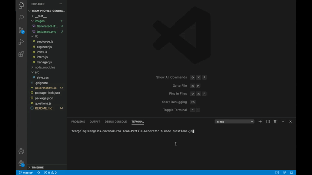
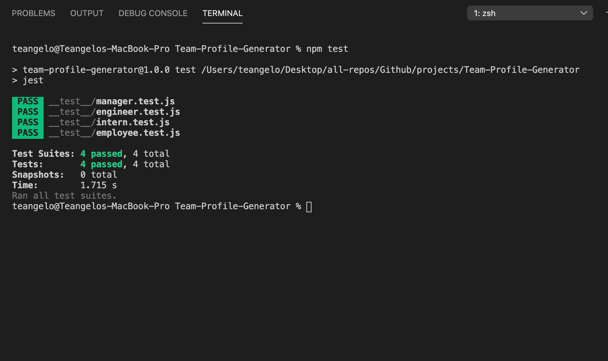

# Build Your Team of Software Dev's

**Developer: Teangelo Burks**

## User Story
```
As often as i bring members on the team
I WANT to build a Team Profile
So THAT i can add new devs to the File
```


## Acceptance Criteria 

```
Given a command line application that accepts user input 
WHEN the user is prompted for information regarding their Role as either a Manager, Engineer, or Intern.
THEN a Html file is generated with the Name, ID, Email Address.
WHEN the role for Manager is selected then an initial question for the Office number will be prompted, 
WHEN the role for Engineer is selected then an Initial question for the Office number will be prompted.
WHEN the role is selected for Inter then an Initial question for the School of Study is prompted
```


# Demonstration: 

&nbsp;

## Generated HTML File:


**Test Cases:**



# Installation:
First step would be to download a IDE(Visual Studio Code), Next step would be to install node.js(Type in the terminal "install node" ), Once node is successfully installed, The next step is to install a package.json file(Type in the terminal "npm init"), Final step is to install the "inquirer" package.

&nbsp;

# Usage:

Once node and all your packages are installed, run the file in the command line(node questions.js ) and answer the prompts to start building a team of software developers.

# License:
None

# Technologies used:

* Node.js
* JavaScript
* Jest testing package
* HTML
* CSS
* Bootstrap 


&nbsp;


# Contact Me
## Github Username: [Teangelo1](https://github.com/Teangelo1)
## Email: burks.teangelo@gmail.com